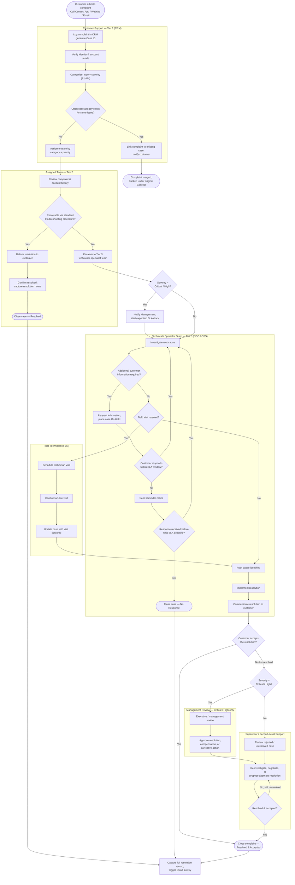

# Telecom Customer Complaint Resolution Process

End-to-end process specification covering complaint intake, triage, tiered
resolution, investigation, escalation, and closure for a telecom service
provider. Includes decision points, exceptions, SLA checkpoints, owners,
systems of record, and inputs/outputs for every major step.

## 1. Scope

Applies to all inbound customer complaints regardless of channel:
**Call Center (IVR/agent)**, **Mobile App**, **Website/Web Portal**, and
**Email**. Covers billing, network/service quality, provisioning/
activation, device/technical, customer experience, and fraud/security
complaint categories from creation through final resolution, closure, and
post-resolution reporting.

## 2. Actors & Systems Glossary

| Actor | Role |
|---|---|
| Customer | Submits the complaint; provides information; accepts or rejects proposed resolution |
| Customer Support (Tier 1) | Logs, verifies, categorizes, deduplicates, and assigns the complaint; attempts no independent troubleshooting |
| Assigned Team (Tier 2) | Owns first-line resolution using standard troubleshooting/runbooks (Billing Ops, Retail/Provisioning, Device Support, Network Care) |
| Technical / Specialist Team (Tier 3) | NOC, Network Engineering, IT/Systems, or Fraud teams performing root-cause investigation |
| Field Technician | Executes on-site visits dispatched via Field Service Management |
| Supervisor / Second-Level Support | Re-investigates rejected or unresolved standard-severity cases |
| Management / Executive Escalation | Reviews and approves resolution/compensation for Critical or High severity cases |

| System | Purpose |
|---|---|
| CRM (e.g., Siebel/Salesforce-class) | Customer profile, complaint logging, case record of truth |
| Case/Ticketing Management | Case lifecycle, SLA timers, assignment, status, audit trail |
| Identity & Account Verification (BSS) | Confirms customer identity, account ownership, service details |
| Knowledge Base / Standard Troubleshooting Scripts | Tier 1/2 resolution procedures by complaint type |
| Network Monitoring / OSS Tools | Network diagnostics, outage correlation, root-cause data |
| Field Service Management (FSM) | Technician scheduling, dispatch, visit reporting |
| Notification Gateway (SMS/Email/Push/IVR) | Customer notifications: acknowledgment, reminders, resolution, closure |
| Billing System | Billing dispute validation, credits/adjustments |
| Reporting / BI & CSAT Platform | SLA tracking, escalation reporting, post-closure satisfaction survey |

## 3. Complaint Categories & Severity Classification

**Categories:** Billing/Charges · Network/Service Quality · Provisioning/
Activation · Device/Technical Support · Customer Experience/Service ·
Fraud/Security

**Severity:**

| Severity | Definition |
|---|---|
| **Critical (P1)** | Full service outage affecting multiple customers, safety issue, or active fraud/security incident |
| **High (P2)** | Major individual service disruption, VIP/high-value customer, or billing dispute above defined threshold |
| **Medium (P3)** | Partial service degradation or standard billing/service query |
| **Low (P4)** | General inquiry-type complaint or minor issue with no material service impact |

## 4. SLA Matrix

| Severity | Acknowledgment | First Response | Resolution Target | Customer Response Window (On Hold) | Reminder Sent | Auto-Close (No Response) |
|---|---|---|---|---|---|---|
| Critical (P1) | Immediate, automated | 30 minutes | 4 hours | 24 hours | at 12 hours | at 24 hours |
| High (P2) | Immediate, automated | 2 hours | 24 hours | 48 hours | at 24 hours | at 48 hours |
| Medium (P3) | Immediate, automated | 8 business hours | 3 business days | 3 business days | end of day 2 | end of day 5 |
| Low (P4) | Immediate, automated | 24 hours | 5 business days | 5 business days | end of day 3 | end of day 7 |

**Escalation SLAs:** Supervisor engages within 4 hours of a rejected/
unresolved Critical or High case (1 business day for Medium/Low).
Management review begins within 24 hours of a Critical/High case being
escalated to Tier 3. Field visits are scheduled within 24 hours
(Critical/High), 48 hours (Medium), or 5 business days (Low) of the visit
being deemed necessary.

## 5. End-to-End Flow Diagram

## 6. Detailed Process Steps

### Phase 1 — Complaint Intake & Logging (Owner: Customer Support, Tier 1)

| Step | Description | System(s) | Input | Output |
|---|---|---|---|---|
| 1.1 | Customer submits complaint via Call Center, Mobile App, Website, or Email | IVR/telephony, App, Web Portal, Email gateway | Customer statement of issue | Raw complaint |
| 1.2 | Log complaint in CRM; system generates a unique Case ID | CRM | Raw complaint, channel metadata | Case record with Case ID |
| 1.3 | Verify customer identity and account details | CRM, Identity/Account Verification (BSS) | Customer ID, account number/MSISDN | Verified account context on case |
| 1.4 | Categorize complaint by type and severity (P1–P4) | CRM, Case Management | Verified case, complaint description | Categorized, prioritized case |
| 1.5 (decision) | Check for an existing open case on the same issue | Case Management | Account ID, complaint category | Duplicate = Yes/No |

**Exception — Duplicate case:** if Yes, link the new complaint to the
existing case, notify the customer of the existing Case ID and status, and
stop this workflow instance (tracked under the original case). If No,
proceed to assignment.

| Step | Description | System(s) | Input | Output |
|---|---|---|---|---|
| 1.6 | Assign case to the appropriate team based on category and priority | CRM, Case Management, Workforce routing | Categorized case | Assigned case, SLA clock started |

**SLA checkpoint:** acknowledgment sent to customer immediately
(automated); assignment must occur within the "First Response" window in
the SLA Matrix.

### Phase 2 — Tier 1/2 Resolution Attempt (Owner: Assigned Team)

| Step | Description | System(s) | Input | Output |
|---|---|---|---|---|
| 2.1 | Review issue and customer/account history | CRM, Knowledge Base, Billing System (if billing) | Assigned case | Diagnostic assessment |
| 2.2 (decision) | Determine whether resolvable via standard troubleshooting | Knowledge Base / runbooks | Diagnostic assessment | Resolvable = Yes/No |

**If Yes:**

| Step | Description | System(s) | Input | Output |
|---|---|---|---|---|
| 2.3 | Provide resolution to customer | Notification Gateway, CRM | Standard fix/answer | Resolution communicated |
| 2.4 | Confirm with customer that the issue is resolved | Call Center/App/Web | Customer confirmation | Confirmed resolution |
| 2.5 | Capture resolution details in the case | CRM | Resolution notes | Complete case record |
| 2.6 | Close case as Resolved | CRM, Reporting/CSAT | Closed case | CSAT survey triggered |

**If No:** escalate the case to the relevant Tier 3 technical or
specialist team (Phase 3).

**SLA checkpoint:** Tier 1/2 attempt must complete within the "Resolution
Target" window before mandatory escalation.

### Phase 3 — Escalation to Tier 3 & Severity Branch (Owner: Assigned Team → Technical/Specialist Team)

| Step | Description | System(s) | Input | Output |
|---|---|---|---|---|
| 3.1 | Escalate case with diagnostic history | CRM, Case Management | Unresolved case | Case reassigned to Tier 3 |
| 3.2 (decision) | Check severity — Critical or High? | Case Management | Case severity | Yes → notify Management, start expedited SLA; No → proceed at standard SLA |

Critical/High severity complaints run on a **separate, expedited
escalation path** in parallel with investigation: Management is notified
immediately for oversight and the case is tracked against the accelerated
SLA row in Section 4, in addition to (not instead of) the standard
investigation steps below.

### Phase 4 — Investigation (Owner: Technical/Specialist Team, Tier 3)

| Step | Description | System(s) | Input | Output |
|---|---|---|---|---|
| 4.1 | Investigate root cause | Network Monitoring/OSS, NOC tools, logs | Escalated case | Investigation findings |
| 4.2 (decision) | Is additional information required from the customer? | Case Management | Investigation findings | Yes/No |

**Sub-flow — Missing information (exception path):**

| Step | Description | System(s) | Input | Output |
|---|---|---|---|---|
| 4.3 | Request information from customer; place case On Hold | Notification Gateway, CRM | Information request | Case On Hold, SLA "Customer Response Window" clock started |
| 4.4 (decision) | Does customer respond within the SLA window? | Case Management | Customer response or timeout | Yes → resume investigation |
| 4.5 | If not, send a reminder notice | Notification Gateway | Reminder trigger (per SLA Matrix) | Reminder sent |
| 4.6 (decision) | Does customer respond after the reminder, before the final deadline? | Case Management | Customer response or final timeout | Yes → resume investigation |
| 4.7 | If still no response, close the case as **No Response** | CRM, Reporting | Final timeout | Case closed, no response |

**Sub-flow — Field visit required:**

| Step | Description | System(s) | Input | Output |
|---|---|---|---|---|
| 4.8 (decision) | Is a field visit required to diagnose or repair? | Case Management | Investigation findings | Yes/No |
| 4.9 | Schedule technician via Field Service Management | FSM | Site/service address, case details | Scheduled visit (per SLA Matrix) |
| 4.10 | Technician conducts the on-site visit | FSM, field tools | Scheduled visit | Visit findings |
| 4.11 | Update case with visit outcome | FSM, CRM | Visit findings | Updated case record |

### Phase 5 — Resolution & Customer Response (Owner: Technical/Specialist Team)

| Step | Description | System(s) | Input | Output |
|---|---|---|---|---|
| 5.1 | Root cause identified | CRM, Case Management | Investigation/visit findings | Confirmed root cause |
| 5.2 | Implement the resolution | Relevant provisioning/network/billing systems | Root cause | Resolution implemented |
| 5.3 | Communicate resolution to customer | Notification Gateway, Call Center | Resolution details | Customer informed |
| 5.4 (decision) | Does the customer accept the resolution? | Call Center/App/Web feedback | Customer response | Accept / Reject or unresolved |

**If accepted:** close the complaint as Resolved & Accepted (Phase 6).

**If rejected or still unresolved:** escalate per Phase 7.

### Phase 6 — Closure & Post-Resolution Reporting (Owner: Customer Support / Reporting)

| Step | Description | System(s) | Input | Output |
|---|---|---|---|---|
| 6.1 | Close complaint as Resolved & Accepted | CRM | Accepted resolution | Closed case |
| 6.2 | Capture full resolution record (root cause, actions, timeline) | CRM, Reporting/BI | Case history | Audit-ready case record |
| 6.3 | Trigger CSAT survey | Reporting/CSAT platform, Notification Gateway | Closed case | Customer satisfaction data |

### Phase 7 — Rejection / Unresolved Escalation Path

| Step | Description | System(s) | Input | Output |
|---|---|---|---|---|
| 7.1 (decision) | Severity Critical or High? | Case Management | Case severity | Yes → Management Review; No → Supervisor review |

**Standard-severity path (Medium/Low):**

| Step | Description | System(s) | Input | Output |
|---|---|---|---|---|
| 7.2 | Supervisor / second-level support reviews the rejected or unresolved case | CRM, Case Management | Case history, rejection reason | Review assessment |
| 7.3 | Re-investigate, negotiate, or propose an alternate resolution | Relevant systems, Notification Gateway | Review assessment | Revised resolution offer |
| 7.4 (decision) | Resolved and accepted? | Call Center/App/Web feedback | Customer response | Yes → close (Phase 6); No → repeat 7.3 |

**Critical/High severity path (separate escalation, mandatory management review):**

| Step | Description | System(s) | Input | Output |
|---|---|---|---|---|
| 7.5 | Executive / management review of case, root cause, and prior resolution attempts | CRM, Reporting/BI | Full case history | Management decision |
| 7.6 | Approve resolution, compensation, or corrective action | Billing System (for credits), CRM | Management decision | Approved resolution mandate |
| 7.7 | Hand off approved resolution to Supervisor/second-level for execution and customer negotiation (Step 7.3 onward) | CRM, Notification Gateway | Approved mandate | Revised resolution offer |

## 7. Exception Handling Summary

| Exception | Trigger | Handling |
|---|---|---|
| Duplicate complaint | Open case exists for same issue at intake | Link to existing case, notify customer, stop new workflow instance |
| Missing customer information | Investigation cannot proceed without more detail | Request info, place On Hold, reminder at SLA midpoint, auto-close as No Response if unanswered by final deadline |
| Field access/repair needed | Root cause requires physical inspection or hardware work | Schedule technician via FSM within severity-based SLA; update case post-visit |
| Customer rejects resolution / remains unresolved | Customer declines proposed fix or issue persists after implementation | Escalate to Supervisor/second-level (standard severity) or Management Review (Critical/High) |
| Critical/High severity at any point | Severity flag set at categorization or re-assessed during investigation | Parallel expedited SLA clock, mandatory Management notification/review, separate escalation path |

## 8. Ownership Summary (RACI)

| Phase | Responsible | Accountable | Consulted | Informed |
|---|---|---|---|---|
| Intake, verification, categorization, dedup, assignment | Customer Support (Tier 1) | Customer Support Manager | — | Customer |
| Standard troubleshooting resolution | Assigned Team (Tier 2) | Tier 2 Team Lead | Customer Support | Customer |
| Root-cause investigation | Technical/Specialist Team (Tier 3) | Tier 3 Manager / NOC Lead | Assigned Team, Field Technician | Customer, Management (if Critical/High) |
| Field visit | Field Technician | FSM Dispatch Lead | Tier 3 | Customer |
| Resolution implementation & communication | Technical/Specialist Team | Tier 3 Manager | Billing (if credits) | Customer |
| Rejection/unresolved escalation (standard) | Supervisor / Second-Level Support | Support Operations Manager | Tier 3 | Customer |
| Rejection/unresolved escalation (Critical/High) | Management / Executive Escalation | Head of Customer Operations | Supervisor, Tier 3 | Customer, Board/regulatory (if required) |
| Closure & reporting | Customer Support / Reporting Team | Customer Support Manager | — | Customer, Quality/BI |

## 9. Governance Notes

- Every state transition (log, verify, categorize, assign, hold, escalate,
  resolve, close) is timestamped in the Case Management system to support
  SLA audit and reporting.
- SLA breaches at any phase trigger automatic notification to the next
  level of ownership per the RACI table.
- All Critical/High severity closures require a documented management
  sign-off attached to the case record before the case can be marked
  Closed.
- CSAT results and root-cause data feed a continuous-improvement review to
  reduce repeat complaints and refine standard troubleshooting scripts.
